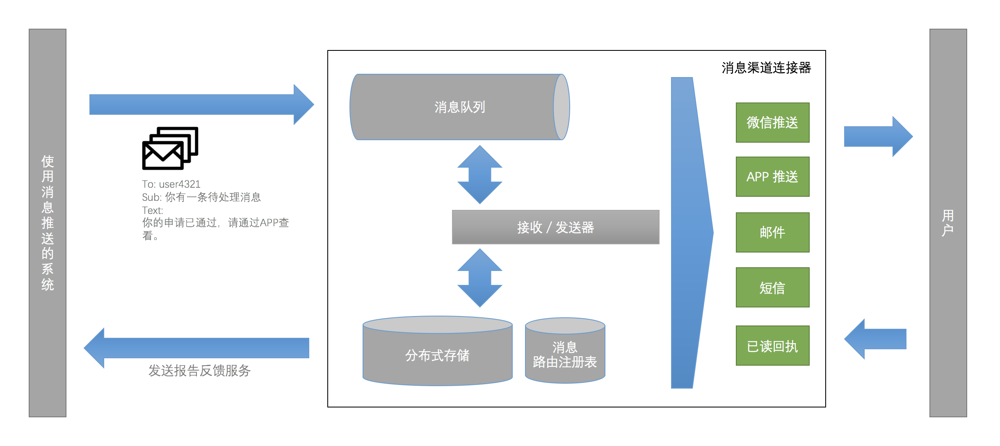

# 消息中心

##1. 目的

明确平台消息体系结构。提供代码编写的依据。

消息中心提供了集成的向用户发送消息的渠道。消息将会自动根据业务类型，发送到用户的指定消息渠道中。

## 2. 系统架构

如上图所示，调用系统将消息发送到 “消息中心”，“消息中心” 将以异步的方式，根据调用系统的要求，通过指定的渠道向用户发送消息。

## 3. 接口定义

#### 3.1 注册消息渠道

部分系统将会收集用户的消息渠道（如：手机号码，微信统一ID），并将消息渠道注册到消息中心中。

- 接口地址

  https://server/msg/register?access_token=xxx

- 输入

  `{`

  ​	uid: 'f9b442e9270a44c185ad23680da98389',

  ​	channel: 'mobile',

  ​	address: '13790000123'

  `}`

- 输出

  `{`

  ​	code: 0,

  ​	message: ''

  `}`

#### 3.2 注册标签

当需要一次性向多名用户发送消息，可以先将用户注册到标签中，然后向标签发送消息。

- 接口地址

  https://server/msg/tag/add?access_token=xxx

- 输入

  `{`

  ​	tag: 'temp',

  ​	uids: [

  ​	 'f9b442e9270a44c185ad23680da98389',

  ​	 'f9b442e9270a44c185ad23680da98310'

  ​	]

  `}`

- 输出

  `{`

  ​	code: 0,

  ​	message: ''

  `}`

  

#### 3.3 删除标签

从消息中心中删除一个标签。

- 接口地址

  https://server/msg/tag/remove?access_token=xxx

- 输入

  `{`

  ​	tag: 'temp'

  `}`

- 输出

  `{`

  ​	code: 0,

  ​	message: ''

  `}`

  

#### 3.4 移除标签中的用户

从一个标签中移除用户。

- 接口地址

  https://server/msg/tag/user/remove?access_token=xxx

- 输入

  `{`

  ​	tag: 'temp',

  ​	uids: [

  ​	 'f9b442e9270a44c185ad23680da98389',

  ​	 'f9b442e9270a44c185ad23680da98310'

  ​	]

  `}`

- 输出

  `{`

  ​	code: 0,

  ​	message: ''

  `}`

#### 3.5 发送模版消息

向一个用户发送消息。

- 接口地址

  https://server/msg/send?access_token=xxx

- 输入

  `{`

  ​	uid: 'f9b442e9270a44c185ad23680da98389',

  ​	'template': 'template1',

  ​	'params': {

  ​		'p1': 'bbb',

  ​	},

  ​	'channel': 'any/all/<channel name>',

  ​	status_callback: 'http://xxxxxxx'

  `}`

- 输出

  `{`

  ​	code: 0,

  ​	message: '',

  ​	data: {

  ​		ref_no : '10086'

  ​	}

  `}`

  

#### 3.5 发送模版消息到标签

向一个标签发送消息。

- 接口地址

  https://server/msg/send_tag?access_token=xxx

- 输入

  `{`

  ​	tag: 'temp',

  ​	'template': 'template1',

  ​	'params': {

  ​		'p1': 'bbb',

  ​	}

  ​	'channel': 'any/all/<channel name>',

  ​	status_callback: 'http://xxxxxxx'

  `}`

- 输出

  `{`

  ​	code: 0,

  ​	message: '',

  ​	data: {

  ​		ref_no : '10086'

  ​	}

  `}`

  

#### 3.6 发送回执

用户收到消息后发送回执到消息中心。

- 接口地址

  https://server/msg/ack

- 输入

  `{`

  ​	ref_no: '10086',

  ​	read_time: 19203939440

  `}`

- 输出

  `{`

  ​	code: 0,

  ​	message: ''

  `}`

  

#### 3.7 查询发送报告

用户收到消息后发送回执到消息中心。

- 接口地址

  https://server/msg/send_report

- 输入

  `{`

  ​	ref_no: '10086',

  `}`

- 输出

  `{`

  ​	code: 0,

  ​	message: '',

  ​	data: {

  ​		report: [

  ​			{uid: 'f9b442e9270a44c185ad23680da98389', status: sent},

  ​			{uid: 'f9b442e9270a44c185ad23680da98389', status: sent}

  ​		]

  ​	}

  `}`

  